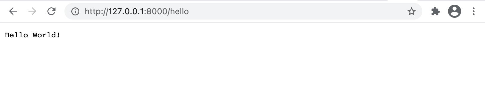

# GoFrame Template For SingleRepo

Quick Start: 
- https://goframe.org/pages/viewpage.action?pageId=1114399


## 快速开始
1. 下载安装对应平台的 GoFrame 开发工具（注意，命名为 gf），下载地址：https://github.com/gogf/gf/releases
2. 执行gf -v指令如果能打印出例如以下信息，表示您已成功安装好了框架工具 
```
gf -v
```
输出
```
GoFrame CLI Tool v2.5.5, https://goframe.org
GoFrame Version: v2.5.2 in current go.mod
.....
```
3. 创建项目
```
gf init go-frame-demo -u
```

4. 进入项目并运行
```
cd go-frame-demo && gf run main.go
```

5. 浏览器访问  http://127.0.0.1:8000/hello ，如果看到如下界面，表示运行成功。



6. 升级框架版本（**真实项目慎用**）。随时可以在项目根目录下（目录下有go.mod），执行以下命令更新使用最新的框架版本：
```
gf up -a
```
这个命令会升级项目中的依赖包，并且会升级 gf 命令行工具到最新版本。


